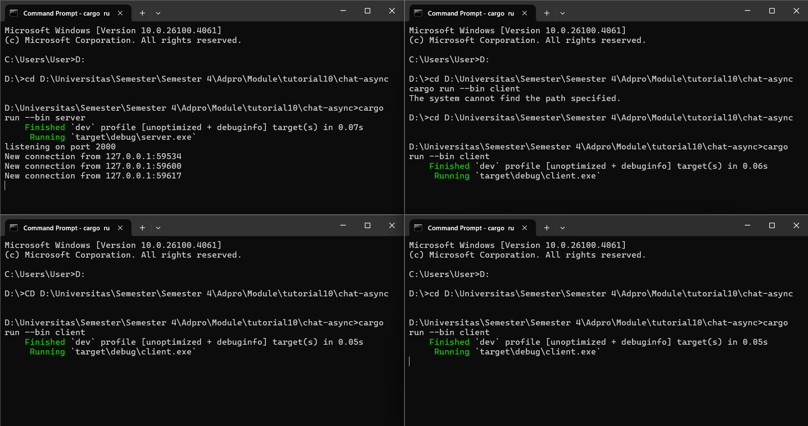
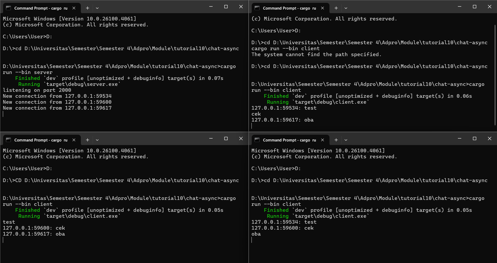

- Running

- Messaging

Explanation
- Berikut adalah versi yang sudah diparafrasekan:

Saya memperoleh hasil tersebut dengan menjalankan perintah `cargo run server` pada satu terminal, kemudian membuka tiga terminal tambahan yang masing-masing menjalankan `cargo run client`. Saat server dijalankan, ia akan mendengarkan koneksi yang masuk pada port 2000. Setiap kali ada client yang terhubung, server akan menampilkan pesan *New connection from...* di konsol. Ketika salah satu client mengirimkan pesan, misalnya "test", server akan mencetak *127.0.0... "test"* dan setiap client lain yang sedang terhubung akan menerima pesan dengan format *127.0.0.... test*. Server secara otomatis mencatat koneksi dari setiap client, sehingga jika ada satu client yang mengirim pesan, semua client yang sedang terhubung akan menerima pesan tersebut.

