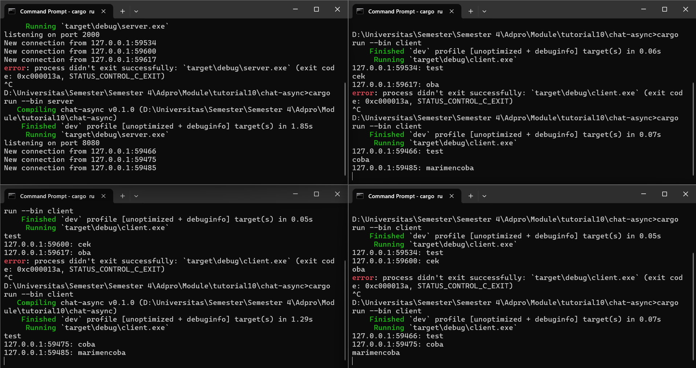

- Running

- Messaging

Explanation
- Saya memperoleh hasil tersebut dengan menjalankan perintah `cargo run server` pada satu terminal, kemudian membuka tiga terminal tambahan yang masing-masing menjalankan `cargo run client`. Saat server dijalankan, ia akan mendengarkan koneksi yang masuk pada port 2000. Setiap kali ada client yang terhubung, server akan menampilkan pesan *New connection from...* di konsol. Ketika salah satu client mengirimkan pesan, misalnya "test", server akan mencetak *127.0.0... "test"* dan setiap client lain yang sedang terhubung akan menerima pesan dengan format *127.0.0.... test*. Server secara otomatis mencatat koneksi dari setiap client, sehingga jika ada satu client yang mengirim pesan, semua client yang sedang terhubung akan menerima pesan tersebut.

- Message with port 8080

Explanation
- Hasil yang diperoleh kurang lebih serupa dengan sebelumnya, di mana server berhasil menerima koneksi dari tiga client yang berbeda. Namun, ketika saya mencoba mengubah port pada kode server dan menjalankan client kembali, muncul error "access is denied". Hal ini terjadi karena server mencatat koneksi client berdasarkan port tertentu. Jika port yang digunakan berbeda, maka client akan mengirim permintaan ke port lain yang tidak dikenali oleh server, sehingga koneksi gagal dan muncul error. Situasi ini menunjukkan bahwa client dan server hanya dapat berkomunikasi dengan baik apabila keduanya menggunakan port yang sama sebagai titik koneksi.
